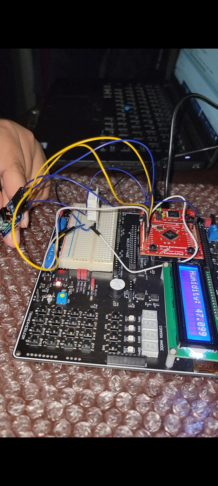

# Smart Irrigation System – ECE 425 Final Project

This is a microcontroller-based project that simulates a smart irrigation controller using real-time sensor input and embedded software techniques.

## Author

**Juan Zendejas**  
Instructor: Professor Aaron Nanas  
Course: ECE 425 – Microprocessor Systems  
Semester: Spring 2025

## Introduction

This project implements a simplified Smart Irrigation System using embedded technology. The system monitors environmental humidity via a DHT22 sensor and makes automated watering decisions. LEDs simulate irrigation behavior, and a rotary encoder allows the user to interact with a menu system. The project was built on the TM4C123GH6PM microcontroller and highlights how embedded systems can contribute to sustainability in agriculture.

## Results and Video Demonstration

The system successfully reads real-time humidity and simulates control logic using GPIO. When humidity drops below 40%, a red LED activates. A menu option allows manual testing of a virtual valve, triggering a blue LED for 2 seconds.

 **Video Demo**:  
[https://youtube.com/shorts/P7gulo7zbaM?feature=share](https://youtube.com/shorts/P7gulo7zbaM?feature=share)

## Demonstration Screenshots

These screenshots were captured from the project video to showcase live system behavior.

### Sensor Readings

*Figure 2: Temperature reading shows 21.3°C, which is typical for indoor conditions.*

*Figure 3: Humidity level reads 47\%, within the normal comfort range.*

### Valve Simulation Test

*Figure 5: Blue LED simulates valve activation when selected from the menu.*

---

## Background and Methodology

This project was designed to demonstrate the practical application of embedded system principles in a real-time environmental monitoring system. It integrates several concepts:

### Embedded Systems Concepts Applied
- **Polling** for DHT22 communication via bit-level GPIO reads.
- **SysTick Timer** for precise microsecond-level delays.
- **GPIO** for digital sensor and output control.
- **GPTM (Timer 0A)** for periodic encoder input.
- **Interrupts** to manage non-blocking user interaction.
- **State-Based Logic** to build a rotary encoder-driven menu system.

### How the Project Goals Were Achieved
The system reads 40-bit DHT22 sensor data using GPIO polling. A rotary encoder provides input, handled using Timer 0A interrupts. State transitions in a menu system allow the user to view temperature/humidity or trigger a valve simulation, indicated by LED outputs.

## Functional Block Diagram

  
*Figure 1: Functional Block Diagram – Smart Irrigation System*

## Components Used

| Component            | Function                                |
|---------------------|-----------------------------------------|
| TM4C123GH6PM         | Microcontroller (LaunchPad)             |
| DHT22 Sensor         | Measures humidity and temperature       |
| PMOD Rotary Encoder  | User menu input                         |
| Red LED (PF1)        | Alert when RH < 40%                     |
| Blue LED (PF2)       | Valve simulation indicator              |
| EduBase Board        | Breakout board for prototyping          |

## Pinout Used

| Function                  | Component           | Pin(s)     |
|---------------------------|---------------------|------------|
| DHT22 Data Line           | DHT22 Sensor        | PE1        |
| Rotary Encoder CLK/DT/BTN | PMOD Rotary Encoder | PD0–PD3    |
| Humidity Alert Indicator  | Red LED             | PF1        |
| Valve Test Indicator      | Blue LED            | PF2        |

